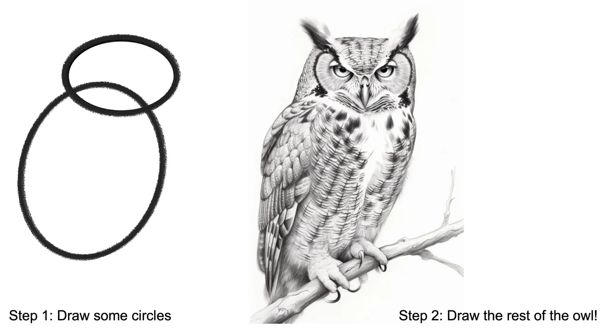

# Capra AI Workshop

I denne workshopen skal vi se nærmere på ulike metoder og oppsett av AI-verktøy som finnes på markedet i dag. Helt konkret skal vi innom:

- AWS sitt AI-studio, Amazon Bedrock, hvor vi ser på hva som er tilgjengelig og hva som er mulig med et par tastetrykk.
- Kjøre flere LLMer lokalt på din egen maskin - ingen behov for noen backend-tjeneste!
- Være innom [HuggingFace](https://huggingface.co/) for å se hvordan man deler og jobber med open source AI-modeller.
- Sette opp en backend-tjeneste som bruker større modeller som kjører lokalt på din maskin
- Om tid: Se på teknikken RAG (Retrieval Augmented Prompting)
- Integrere backend-tjenesten med Amazon Bedrock sine APIer

For å kunne fullføre kurset trenger du:

- En AWS-konto
- Enkle programmeringsferdigheter innen JavaScript/TypeScript og Python
- En maskin med minst 8GB RAM

## Del 1: Intro til Amazon Bedrock

<details>
<summary>Hva er Amazon Bedrock?</summary>

Amazon Bedrock er en fullt administrert tjeneste som gir utviklere og organisasjoner tilgang til en rekke store språkmodeller (LLMs) og generative AI-modeller via et enkelt API-grensesnitt. Tjenesten inkluderer modeller fra ledende AI-selskaper som Anthropic, AI21 Labs og Stability AI, samt Amazon's egne modeller.

Teknisk sett fungerer Bedrock som et abstraksjonslag over kompleks AI-infrastruktur. Det håndterer oppskalering, nedskaling og ressursallokering automatisk, noe som eliminerer behovet for manuell administrasjon av underliggende maskinvare og programvare.

En viktig funksjonalitet i Bedrock er muligheten for modell-tilpasning. Dette lar brukere finjustere forhåndstrente modeller på egne datasett, noe som kan forbedre modellens ytelse for spesifikke bruksområder. Prosessen foregår innenfor kundens AWS-miljø, noe som ivaretar datasikkerhet og personvern.

Bedrock integreres sømløst med andre AWS-tjenester, noe som muliggjør utvikling av ende-til-ende AI-løsninger. For eksempel kan man kombinere Bedrock med Amazon S3 for datalagring, Amazon SageMaker for ytterligere maskinlæringsoppgaver, eller AWS Lambda for serverløs behandling av AI-generert innhold.

API-et til Bedrock støtter både synkrone og asynkrone forespørsler, noe som gir fleksibilitet for ulike bruksscenarier. For lange eller ressurskrevende oppgaver kan asynkrone kall være særlig nyttige.

Tjenesten kan brukes til en rekke oppgaver innen naturlig språkbehandling og generativ AI, inkludert tekstgenerering, semantisk søk, sentiment-analyse, og oversettelse. Den støtter også multimodale modeller som kan generere eller analysere både tekst og bilder.

</details>

I denne delen skal vi aktivere og bruke noen av modellene som er tilgjengelig gjennom [Amazon Bedrock](https://aws.amazon.com/bedrock/).

1. Logg inn i AWS-konsollen med din Capra- eller personlige bruker. Det vi skal gjøre koster ikke store summer, så her er det bare å slå seg løs.
2. I listen over services, velg: Machine Learning -> Amazon Bedrock
3. Du er nå inne i Amazon Bedrock sitt Studio. Klikk deg rundt og bli bedre kjent med løsningen.
4. Vi skal se nærmere på funksjonen `Chat/Text`. Dette er et verktøy for å enkelt interagere med LLMer i form av en chat. Klikk deg inn på `Chat/Text` i venstre side-meny.
5. For å kunne benytte seg av tjenesten trenger vi å aktivere tilgang til et par AI-modeller. Trykk på knappen "Select model" og se gjennom hvilke modeller man har tilgjengelig. Trykk "Request access" for å komme til modell-bestilleren. Trykk "Modify model access".
6. Modellene fra Anthrophic er for øyeblikket kjent som de beste på markedet - bedre enn ChatGPT 4o på flere områder. Om Claude 3.5 Sonnet, Claude 3 Haiku og Claude 3 Sonnet er tilgjengelig, huk av for å få tilgang. Velg også `Titan Image Generator G1 v2` fra Amazon og `SDXL 1.0` fra Stability AI. Ta gjerne med flere også. Det koster ingenting.

<details>
<summary>Hva er alle disse modellene?</summary>

Amazon utvikler noen modeller selv, men deres største styrke er at de tilgjengeliggjør modeller fra andre tilbydere under et enhetlig API.

Modellene som er tilgjengelige innen tekstgenerering er noen av de beste som finnes, og utvalget er stort. For bildegenerering er utvalget mindre, og state-of-the-art er ikke tilgjengelig. For øyeblikket er bildegenerering begrenset til Amazons egne Titan-modeller og en modell fra Stability AI (SDXL v1.0).

Om du er interessert i å lese mer om de beste bildegeneratorene der ute, sjekk ut:

- [Dall-E 3](https://openai.com/index/dall-e-3/) fra OpenAI
- [Midjourney 6.1](https://www.midjourney.com/home) fra Midjourney
- [Stable Diffusion 3.5 Large](https://stability.ai/) fra Stability AI

Det finnes også andre kategorier av modeller:

**Lyd**

- [Synthesia](https://www.synthesia.io/features/languages)
- [Assembly.ai](https://www.assemblyai.com/) <- Veldig god til podcasts!
- [Whisper](https://openai.com/index/whisper/) fra OpenAI

**Video**

- [Sora](https://openai.com/index/sora/) fra OpenAI (Ikke tilgjengelig for allmennheten)
- [Synthesia Video](https://www.synthesia.io/video-templates) Eksempel: [video generert gjennom Synthia Studio](https://share.synthesia.io/627708f6-e273-4bb3-a89a-0eb7e3a8176a)

</details>

7. Klikk "Next" nederst på siden og "Submit". Du burde ha tilgang til modellene innen 2 - 5 minutter.
8. Test ut Chat/Text med noen av modellene. Se om du finner forskjeller mellom modellene og gjør deg opp en mening om hvilke som fungerer best

<details>
<summary>Hva skal du spørre om?</summary>

De fleste språkmodeller er gode nok til å gi deg oppskrifter eller forslag på middagsretter, selv på norsk. Spør heller om litt mer avanserte ting, for å teste at modellen forstår sammenheng og opplysninger i teksten du gir den.

For noen gode eksempler på prompts, sjekk ut [denne bloggen om teamet](https://medium.com/@woyera/top-10-ways-to-measure-how-smart-your-ai-really-is-a-fun-guide-06e232656231).

</details>

9. Test ut Image-funksjonen med SDXL-modellen. Prøv å generere noen bilder og evaluer om kvaliteten er på et tilfredsstillende nivå.

Hva betyr parametrene `p`, `k` og `temperature`? For en god forklaring, sjekk ut [Amazons forklaring på parametrene](https://docs.aws.amazon.com/bedrock/latest/userguide/inference-parameters.html?icmpid=docs_bedrock_help_panel_playgrounds).

## Del 2: LLMer i nettleseren din

Vi skal nå dykke ned i `frontend`-koden i dette repoet.

For å spinne det opp, gjør følgende:

```
cd frontend/
npm install
npm start
```

1. Gjør deg kjent med koden. Dette er en helt standard React-app med TailwindCSS og en [Web Worker](https://developer.mozilla.org/en-US/docs/Web/API/Worker) som skal gjøre jobben for oss. Om du ikke har jobbet med en Web Worker før kan du bruke [Web Worker tutorial](https://developer.mozilla.org/en-US/docs/Web/API/Web_Workers_API/Using_web_workers) som referanse på hvordan en sender meldinger frem og tilbake mellom workeren og hovedkoden din. De viktigste filene er `src/App.tsx` og `public/worker.js`.
2. Vi skal nå laste inn en modell i `worker.js` som skal være vår chat-modell. [Biblioteket](https://www.npmjs.com/package/@xenova/transformers) vi skal bruke er allerede definert som en import i toppen av `worker.js`. Sjekk ut dokumentasjonen til [Transformers biblioteket](https://www.npmjs.com/package/@xenova/transformers) for detaljer på hvordan det skal brukes. Inne i dokumentasjonen finner du en referanse til "[hosted pretrained models](https://huggingface.co/models?library=transformers.js&sort=trending)", dette er en liste over kompatible biblioteker. Finn en modell med et kult navn og legg inn navnet som `MODEL_NAME` i `App.tsx`.

<details>
<summary>Hva er ONNX modeller?</summary>

ONNX (Open Neural Network Exchange) modeller er et åpent, plattformuavhengig format for representasjon av maskinlæringsmodeller.

Den definerer en beregningsgraf bestående av noder (operasjoner) og kanter (dataflyt), og støtter et standardisert sett med operatører og datatyper. ONNX muliggjør interoperabilitet mellom ulike ML-rammeverk, forenkler modelloptimalisering og deployment, og støttes av et bredt økosystem av verktøy.

Formatet inkluderer metadata og er utvidbart for spesifikke anvendelser. Dette gjør ONNX til en nøkkelteknologi for å standardisere utveksling og distribusjon av AI-modeller på tvers av plattformer og miljøer.

</details>

3. `MODEL_NAME` blir sendt til Web Workeren når man trykker på "Download model"-knappen i UIet. Fyll ut `downloadModel`-funksjonen i `worker.js` så du ender opp med en modell som er lastet inn gjennom `transformers.js`. Sjekk ut dokumentasjonen til biblioteket for hvordan man gjør dette. Tips: Det kan være en grei løsning å lagre den opprettede modellen på "globalt" scope i `worker.js`.
4. Hurra! Du har nå en modell lokalt på din egen maskin! Nå trenger vi bare å bruke den til å [generere tekst](https://huggingface.co/tasks/text-generation#completion-generation-models). De fleste modellene som kan brukes med `transformers.js` har en README med [eksempler på bruk](https://huggingface.co/Xenova/Qwen1.5-0.5B-Chat). Implementer funksjonen `generateResponse` i `worker.js` til å ta i mot en melding fra brukeren og sende tilbake et svar fra modellen.
5. Du har nå en fungerende chatbot! Prøv deg frem med ulike prompts og tester slik du gjorde gjennom grensesnittet til Amazon Bedrock. Er din lokale modell like god som AWS sone modeller?
6. Bonusoppgave: Det er lagt opp til at AI-modellen kun mottar en enkelt melding og svarer på den. Kan du endre APIet så du sender med hele chat-historikken, så den får med seg mer kontekst?

## Del 3: O-la-la-la LLaMa!

I denne delen skal du laste ned og kjøre litt større modeller lokalt. Det finnes mange ulike verktøy til dette, hvor noen er avhengige av operativsystem og maskinarkitektur. Vi skal benytte verktøyet [Ollama](https://ollama.com/), som i (teorien) skal fungere på både Windows, Mac og Linux.

1. Følg [instruksjonene](https://ollama.com/) for å laste ned og installere Ollama.
2. Last ned og test ut [LLaMa 3.2](https://ollama.com/library/llama3.2:3b), Metas nyeste modell som er optimalisert til å kjøre på maskiner med begrensede ressurser (Ja, din 64GB M3 Mac er en begrenset ressurs).
3. Test ut et par andre modeller fra [listen over støttede modeller](https://ollama.com/library).
4. Bonusoppgave: Prøv deg ut med en annen engine, [llama.cpp](https://github.com/ggerganov/llama.cpp). Denne motoren kan brukes til mer enn Ollama, som for eksempel modeller som ikke er trent opp til selvsensurering. Til gjengjeld er det mye mer mas å faktisk få det opp og kjøre med en modell som fungerer greit.

## Del 4: Host din egen LLM gjennom et API

På tide å erstatte den lokale LLMen i nettleseren din med en litt kraftigere og mer effektiv backend som hoster modellen din. I denne delen skal vi dykke ned i `backend`-koden i dette repoet.

For å spinne det opp, gjør følgende:

```
cd backend/
python3 -m venv .venv
source .venv/bin/activate  # NOTE for Windows: source .venv/Scripts/activate
pip install -r requirements.txt
fastapi dev main.py
```

1. Gjør deg kjent med koden. Dette er en helt standard [FastAPI](https://fastapi.tiangolo.com/)-app som bruker [Pydantic](https://docs.pydantic.dev/latest/) til å definere datatyper.
2. Vi skal nå bruke Python-biblioteket [ollama](https://github.com/ollama/ollama-python). Bruk [Generate](https://github.com/ollama/ollama-python?tab=readme-ov-file#generate)- eller [Chat](https://github.com/ollama/ollama-python?tab=readme-ov-file#chat)-APIene. Hele [APIet til Ollama er definert her](https://github.com/ollama/ollama/blob/main/docs/api.md), bruk det gjerne som referanse. Et godt tips er å holde deg unna streaming responses, denne workshoppen er ikke lagt opp til å ta det i bruk.
3. Endre koden i endepunktet `/chat` til å ta i mot meldingen fra brukeren, genererer et svar gjennom `ollama` og send en respons i retur.
4. Endre koden i `frontend` til å sende meldinger til `backend` sitt `/chat` endepunkt i stedet for `worker.js`. Sjekk ut `src/api-service.ts` for en enkel klient til dette formålet. Får du bedre eller dårligere svar fra modellen du bruker i backend? Hvorfor? Er det noen forskjell i hastighet?
5. Bonusoppgave: Kan du endre APIet så du sender med hele chat-historikken, så modellen i backend får med seg mer av konteksten i samtalen, og gir et bedre svar?

## Bonus: Del 4.1: Retrieval Augmented Generation

Dette er en oppgave hvor følgende bilde blir relevant:



TL;DR: Bruk `testcontainers` til å spinne opp en `pgvector`-container og bruk denne til å søke i en innholdsdatabase over data for å svare på spørsmål.

1. Spinn opp en `pgvector`-container med Docker eller `testcontainers`.
2. Les [denne guiden](https://www.kaggle.com/code/arashnic/rag-with-sentence-and-hugging-face-transformers) om hvordan du kan lage `embeddings` av tekst, hva det er og hvordan det fungerer.
3. Opprett en tabell i `pgvector`-databasen din og sett inn litt tekst og dets tilhørende embeddings
4. Skriv SQL for å finne de semantisk likeste tekstene og sett dem inn i promptet du sender videre til `ollama`.
5. Om du rekker dette er du rask nok og har mest sannsynlig god nok kontroll til å hjelpe de andre på kurset. Reis deg opp og bidra som medhjelper.

## Del 5: Amazon Bedrock API

Maskinvaren på din laptop er god, men ikke god nok til å kjøre virkelig store modeller som LLaMa 3.1 405B. Dette trenger vi en serverpark med GPUer til å kjøre for oss. På tide å bruke denne berømte #skyen for det den er verdt.

1. Tilbake i `backend`-repoet er det allerede lagt inn biblioteket `boto3`. På tross av hva navnet skulle tilsi er dette AWS sin offisielle SDK i Python-økosystemet. For å koble til AWS må du opprette en [Session](https://boto3.amazonaws.com/v1/documentation/api/latest/reference/core/session.html#boto3.session.Session). For å starte en Session trenger du `aws_access_key_id`, `aws_secret_access_key` og `region_name`. For å opprette en access key kan du følge [denne guiden](https://docs.aws.amazon.com/IAM/latest/UserGuide/access-key-self-managed.html#Using_CreateAccessKey). `region_name` setter du til den regionen du bruker i nettportalen. Default her er `us-east-1`.

<details>
<summary>Hvorfor navnet boto3?</summary>

Boto (Uttalt boh-toh) er en type ferskvanns-delfin som bor i Amazonas-elven.

</details>

2. For å kommunisere med modellene du aktiverte i Del 1 av denne workshoppen kan du følge [denne guiden](https://docs.aws.amazon.com/code-library/latest/ug/python_3_bedrock-runtime_code_examples.html). Modellnavn og parametere avhenger av modellvalget du gjorde tidligere. Endre koden i `/bedrock` til å bruke modeller gjennom Amazon Bedrock.
3. Endre `frontend`-koden til å bruke endepunktet `/bedrock` i stedet for `/chat`. Endepunktene bruker i utgangspunktet samme datamodell, så endringene burde være minimale. Får du raskere svar fra Bedrock enn `ollama`?
4. Bonusoppgave: Om du ikke allerede har gjort det, endre APIet så du sender med hele chat-historikken.

## Bonus: Del 5.1: Bildegenerering gjennom Amazon Bedrock

Amazon Bedrock har også mulighet til å generere bilder gjennom APIet sitt. Bruk `boto3` til å generere bilder og send dem tilbake til klienten. Du kan for eksempel implementere at meldinger som begynner med `image:` skal sendes til SDXL i Bedrock i stedet for en tekst-modell.
